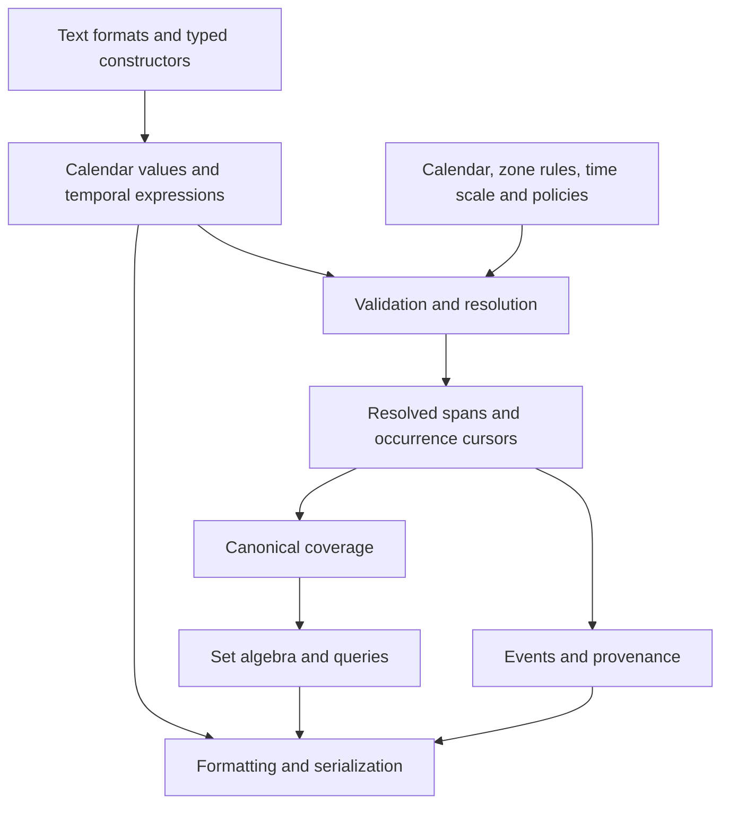
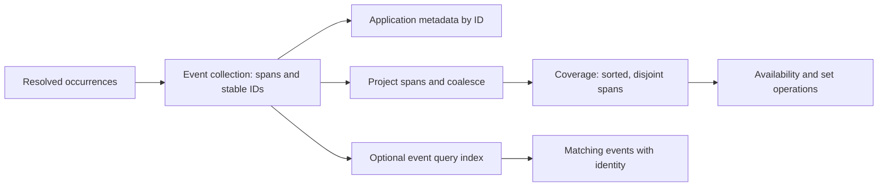
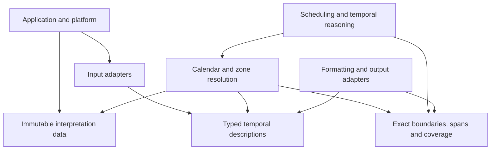

# roc-time design

`roc-time` models human time as calendar meaning and computable spans. It takes [Kip Cole's Tempo](https://github.com/elixir-tempo/tempo) as its starting point and expresses its interval-oriented ideas through small, explicit Roc types and a compact, pure computational core.

This document describes the intended architecture, not the current implementation. It governs semantic boundaries, dependencies, and performance expectations. Compiler-specific observations and benchmark results inform implementation decisions without becoming permanent architectural assumptions.

Contributor methodology belongs in [AGENTS.md](AGENTS.md). Proposed API examples below specify intended usage and observable behavior; they do not claim that the placeholder package already implements these modules.

## Principles

1. **Preserve meaning until interpretation is explicit.** A calendar day, a recurring appointment, and an uncertain historical date contain information that endpoints alone cannot preserve.
2. **Compute on exact, canonical values.** Resolve calendar and zone interpretation before repeated interval operations. Support microseconds without floating-point loss of equality or ordering.
3. **Make distinctions visible in types.** Calendar arithmetic, elapsed arithmetic, coverage, event identity, uncertainty, and unresolved interpretation have different contracts.
4. **Keep the core pure and portable.** Clocks, files, network access, locale data, and zone-data loading belong to the application or its platform. Given the same values and interpretation context, library operations produce the same results.
5. **Pay for expressiveness where it is needed.** A comparison of two resolved spans must not traverse syntax trees, allocate metadata, or consult a zone database.
6. **Optimize under a stable semantic contract.** Storage choices may evolve. Correctness, exactness, and documented behavior must survive those changes.

## Architecture at a glance

There are three principal stages: describe time, resolve its meaning, and compute with the result. Formatting can operate on descriptions or on resolved values with an explicit presentation context.



Resolution is an explicit boundary with an explicit result. It can succeed, require more context, encounter ambiguous civil time, or produce no occurrences. A query that finds no matching time is different from a query that cannot be evaluated.

The original description remains useful after resolution. A future meeting may need re-resolution when zone rules change; a resolved historical observation may need its original wording for display. Neither representation is reconstructed by guessing from the other.

## The temporal model

### Observable contracts

An operation's name and result must identify which question it answers. The conceptual names here guide the API; a particular representation must not change their meaning.

| Question | Contract |
|---|---|
| Do two values occupy the same time? | Extent equality after explicit resolution to compatible axes; ignores presentation and event IDs |
| Were they described the same way? | Description equality includes resolution, calendar form, qualifications, and interpretation intent |
| Are these the same event? | Application event identity; equal spans do not imply equal events |
| How many intervals are present? | Coverage member count, after coalescing |
| How many appointments occur? | Occurrence count before projection to coverage |
| How many days or hours are visited? | Explicit calendar/elapsed walk with a stated step; never an implicit meaning of collection count |
| How wide is this coverage? | Sum of coordinate widths on its stated scale, with checked accumulation |

Coordinate width on a POSIX-like axis must not be advertised as physical elapsed SI seconds across leap-second events. An elapsed-time API states which scale and conversion evidence justify that interpretation. Two immutable resolutions made with different zone-data versions can still be compared if their resulting axes are compatible; provider version is provenance and cache identity, not an automatic inequality of extents.

### Calendar values describe spans at a resolution

A year, month, day, or clock reading denotes a span at its stated resolution. A microsecond-resolution timestamp denotes one microsecond of time. Boundaries are exact positions used to construct spans and answer point queries; they are not required to masquerade as calendar values.

For a fully interpreted day, the span runs from that day's start to the next day's start. The upper boundary is exclusive. There is no “last microsecond of the day” calculation in the model.

Resolution is semantic information, not a storage unit. Microsecond storage does not imply that a year was supplied with microsecond precision. Iteration step is another independent concept: a day can be walked by hours or a larger interval by days.

Calendar descriptions use typed fields and explicit variants for supported forms such as calendar dates, week dates, ordinal dates, and local clock values. Rich selections and qualifications belong in expression types. Ordinary dates should not require a list of dynamically named components.

### Coordinate domains are explicit

Civil days, local clock positions, resolved timeline positions, and monotonic clock readings are different domains. Comparing their underlying numbers is meaningless without a conversion contract.

Nominal types and module boundaries prevent accidental mixing. A zone offset is not a named zone, and a local date-time is not automatically UTC. A clock interval that crosses midnight requires a date anchor or an explicit interpretation on the cyclic clock domain.

Every resolved timeline has a defined epoch, time scale, precision, and supported range. Operations combine only compatible domains. Context shared by an entire coverage value should be checked once at its boundary, rather than carried and checked on every endpoint comparison.

### Spans are half-open and nonempty

A finite span has two boundaries with `start < end` and denotes `[start, end)`. Consequently:

- `[a, b)` and `[b, c)` touch but do not overlap.
- Their coverage union is `[a, c)`.
- Intersection emits a span only when its lower boundary is less than its upper boundary.
- Empty results have an explicit empty representation, usually empty coverage; reversed boundaries are invalid.

A span constructor rejects equal endpoints as `EmptySpan` and reversed endpoints as `ReversedBounds`; set intersection represents no overlap as empty coverage. At a finite representation limit, a calendar value whose exclusive upper boundary cannot be represented returns `OutOfRange`. It is never silently shortened to fit. A point query at the largest supported boundary remains distinct from constructing a one-microsecond span there.

Open-ended descriptions use explicit unbounded variants. Unknown boundaries use different variants: lack of knowledge does not mean infinity. Finite computation accepts open descriptions only after bounding them, or through an operation specifically defined for unbounded values. Finite integer values are never reserved as infinity sentinels.

### Elapsed and calendar quantities are distinct

An elapsed quantity is an exact signed displacement on an appropriate time scale. A calendar quantity describes operations such as advancing a month or a civil day. Its elapsed width depends on its anchor, calendar, and possibly zone rules.

Calendar arithmetic specifies component order and policies for invalid destinations, such as advancing from the last day of a long month into a shorter month. Policies are explicit values; an operation does not silently choose between rejecting, clamping, and carrying. Calendar years must not be reduced to a fixed number of months for calendars where that equivalence does not hold.

Adding a civil day preserves the intended calendar operation across offset transitions. Adding 24 elapsed hours preserves an elapsed displacement. Neither operation is implemented through the other without proving the equivalence for the relevant context.

## Microseconds and physical representation

### Implemented coordinate profile

`PosixBoundary` uses the POSIX epoch 1970-01-01T00:00:00Z with exact signed
I64 microseconds, including both integer endpoints. This numerical profile does
not claim a calendar/provider range. Leap seconds have no distinct representation.
`PosixDelta` is a signed coordinate displacement, not a physical SI elapsed
quantity. `difference(a, b)` computes a minus b with checked subtraction.
`PosixSpan.coordinate_width` returns that same coordinate quantity and may fail
even when a span's two boundaries fit. No time-scale conversion data is used or
implied. Numeric nanosecond and Dec conversion supports `RejectSubmicrosecond`,
`Floor` (toward negative infinity), `Ceiling` (toward positive infinity),
`TowardZero`, and `NearestTiesEven`. Exact input remains the default for
`from_nanoseconds`; its `from_nanoseconds_with_rounding` companion takes an explicit
policy. `from_seconds` requires a policy. Rounding operates on the scaled integer
before narrowing to I64, so overflow is determined by the rounded result.
`PosixSpan.from_seconds` first rejects equal/reversed source endpoints, applies
the same explicit policy to both, and rejects a collapsed result as `EmptySpan`.
These numeric conversions do not imply support for sub-microsecond calendar
resolution.

The public semantic contract requires exact microsecond boundaries and arithmetic throughout the documented range, including negative coordinates. Range limits and overflow are explicit; precision must not degrade for distant dates.

**Resolved boundaries use signed I64 microseconds.** Elapsed quantities also use signed I64 microseconds, with distinct nominal types. A finite span stores two boundaries. Dec seconds remain an exact input/output convenience, not the core storage format.

Assume 64-bit machines as the default deployment target. I64 microseconds provide exact arithmetic over approximately ±292,000 years from the epoch. This is a pragmatic general-purpose time model for scheduling, civil time, and historical applications, rather than a specialized high-resolution timestamp system.

**Nanosecond support was deliberately rejected for the core.** Retaining a broad date range at nanosecond precision would require the larger representation we considered; I64 nanoseconds instead restrict the range to roughly ±292 years. I64 microseconds halve boundary and span payloads compared with Dec or I128, and follow [Tempo's microsecond precision](https://github.com/elixir-tempo/tempo/blob/e8a074ed1efed6a0f78b87d900fc4cb0c4156278/lib/tempo/microsecond.ex) more closely. This aligns the resolution with the reference implementation without copying its storage layout or claiming complete API compatibility.

The tradeoff is explicit: distinct sub-microsecond timestamps cannot always be represented distinctly. Such input is rejected by default; rounding requires an explicit policy. No parallel nanosecond core is planned. A specialized type can be considered later for a demonstrated use case without complicating the common representation now.

| Core payload | Representation | Bytes |
|---|---|---:|
| Resolved boundary | One I64 | 8 |
| Elapsed quantity | One I64 | 8 |
| Finite span | Two I64 boundaries | 16 |
| Coverage elements | Flat list of spans | 16 per capacity slot |

These are numerical payload sizes. Collection headers, allocation overhead, and collection-level context are additional; verify final Roc layouts when implementing the types. Keep axis and interpretation context outside each span payload, enforcing compatibility through nominal types and collection boundaries. A million spans require 16 MB of numeric payload, compared with 32 MB for the previously considered 128-bit boundaries; this is a storage reduction, not a measured throughput claim.

The representation is private and must satisfy these rules:

- Integer equality and ordering correspond exactly to temporal equality and ordering within one domain.
- Integer microseconds need no precision conversion. Nanosecond input must be divisible by 1,000 or use an explicit rounding policy before a checked conversion to I64.
- Dec seconds are converted through their exact scaled integer: `Dec.to_attos(value)` must be divisible by 1,000,000,000,000 under the reject policy. Divide before the checked I64 conversion; do not first narrow the scaled value or convert through floating point.
- Conversions reject overflow and unsupported precision. Rounding policies specify negative behavior; rounding an interval that collapses or reverses its endpoints must not produce a valid nonempty span.
- Boundary arithmetic, subtraction, and width accumulation use checked I64 operations. A displacement outside the quantity range returns `OutOfRange`, even if both endpoints individually fit. Operations that could create sub-microsecond results require validation or explicit rounding.
- Numeric boundary conversion may accept finer-spelled values that are exactly microsecond-aligned. A calendar value declaring a sub-microsecond span still requires an explicit resolution conversion or returns an unsupported-resolution error.
- Negative calendar decomposition has defined floor-division behavior. Calendar arithmetic does not depend on the endpoint's numeric encoding.

The numerical boundary domain is signed I64 microseconds. Constructible spans also need a representable exclusive end, so the greatest boundary cannot start a one-microsecond span. Calendar and provider operations publish their narrower supported ranges. Numerical capacity alone is not a claim that a calendar or zone provider supports every representable coordinate.

Serialization describes semantic values, units, and interpretation. It does not expose native record layout, compiler tags, or the private endpoint encoding. Changing storage must not reinterpret persisted data.

## Coverage and events

**Coverage answers where time is occupied. Events answer what happened or is planned there.** They share spans but have distinct collection invariants.



Coverage has one canonical form: finite nonempty spans, sorted by start, with overlaps and touching spans merged. Empty coverage is valid. This makes extent equality independent of construction order or original segmentation.

The implemented `Coverage` is opaque and specialized to the POSIX axis. Its
`from_spans` constructor accepts validated `PosixSpan` values and cannot fail;
`from_sorted_spans` additionally checks nondecreasing starts and returns
`UnsortedInput` on a violation. `member_count` counts canonical members, and
`coordinate_width` returns a checked `PosixDelta`. `overlapping_spans` and
`fold_overlaps` return whole overlapping members; `intersection` is the operation
for clipped extents. `complement_within` requires one explicit finite span and
seeks to the first relevant member before emitting gaps. `to_spans` may share
the immutable backing list; it makes no promise to detach retained storage.
The executable [coverage example](examples/coverage/main.roc) exercises resolved
availability; parsing offsets and event identity in the broader motivating
scenario remain separate implementation work.

The default storage is a flat Roc `List` of compact span records. Sorted disjoint spans have increasing starts and ends. Binary search can locate the first span whose end exceeds a query's start, followed by a scan until starts reach the query's end. A coverage overlap query therefore does not require an interval tree.

Events can overlap, touch, and have identical extents while remaining distinct. Metadata stays in a separate application-facing layer, referenced by stable IDs where appropriate. Coalescing events into coverage is intentionally lossy and explicit. Event identity cannot be recovered from the coverage result.

An event index is a derived acceleration structure. Choose its representation for its workload; arbitrary overlapping events do not satisfy coverage's binary-search assumptions. Flat indexed nodes or other packed structures are preferred candidates before adopting many individually allocated nodes.

Operations that retain provenance must define how contributors combine and how segments split. Their result size can exceed that of plain coverage. They do not inherit coverage's costs or coalescing rules by assumption.

## Interpretation and dependencies

The calendar layer converts between validated civil fields and a shared civil-day axis within its supported range. Gregorian conversion is the initial foundation; additional calendars implement the same conceptual contract without imposing their complexity on span algebra.

The initial Gregorian provider uses astronomical year numbering (year zero is
1 BCE), with years -2147483648 through 2147483647 inclusive. All months and valid
days in those years are supported. This explicit 32-bit year domain contains
the entire I64 POSIX microsecond date range while leaving ample I64 headroom for
calendar conversion. It does not extend any zone provider's range.
`GregorianDate` validates fields once and preserves their day resolution.
`CivilDay` is a separate opaque signed I64 day coordinate, with zero denoting
Gregorian 1970-01-01; it is neither a UTC midnight nor an elapsed duration.
Gregorian conversion accepts day numbers -784353015833 through 784351576776.
Dates describe civil extents `[day, day + 1)`; mapping those extents to a timeline
requires explicit zone interpretation. Numeric civil coordinates outside this
provider range remain representable, but Gregorian interpretation returns
`OutOfRange`.

Conversion counts complete Gregorian years using floor division and walks at
most eleven preceding months. Inverse conversion uses at most 32 binary-search
probes for the year and eleven month advances. Negative-year floor division and
400-year periodicity follow the proleptic convention described in
[Howard Hinnant's calendar derivation](https://howardhinnant.github.io/date_algorithms.html).
The implementation uses January-based year counting rather than that source's
March-based conversion code. Calendar arithmetic and cross-calendar fixtures
remain work in progress; these conversion APIs alone do not establish R05–R06.

Zone resolution maps local values using a supplied ruleset. A local boundary may have one matching position, be ambiguous, or lie in a gap. Policies and structured outcomes expose those cases. Resolving both boundaries of a calendar span must also validate the resulting span: exceptional civil dates can be skipped or altered by zone transitions.

Distinguish **an appointment between chosen boundary occurrences** from **all positions whose local labels fall in a selection**. The former resolves each endpoint under explicit gap/fold policies and validates their order. The latter computes the preimage of the civil selection under zone rules and may yield empty or disconnected coverage. Taking the earliest start and latest end would incorrectly fill gaps between repeated local-time ranges. Calendar-day selection uses this set interpretation; a skipped civil day yields empty coverage. Fixed-offset conversion is the simple special case.

Boundary resolution reports `Unique`, `Gap`, or `Fold` inside a successful interpretation result; unknown zones, missing rules, out-of-range data, and inconsistent supplied offsets are errors. A strict resolver may turn a gap/fold into a policy error, but never silently chooses an occurrence. An explicit numeric offset supplied with a named zone must be checked against the selected occurrence.

Time-scale conversion is separate from zone conversion. A POSIX-like scale cannot uniquely represent leap seconds. Unsupported leap-second input must remain explicit or return an error; it must not be normalized into a different second. A leap-aware interpretation requires a defined scale and conversion data with a documented validity range.



Arrows here point from a consumer to its dependency. The application acquires clock readings and interpretation data and supplies them to the library. The core has no dependency on the application, adapters, or interpretation providers. Providers are explicit data and operations, not a global registry. Their exact Roc signatures should allow specialization and avoid repeated dynamic dispatch in inner loops.

Resolved values are snapshots of a particular interpretation. Updating zone or calendar data does not mutate their meaning. Re-resolving an expression is a distinct operation. Caches must be tied to the source description, relevant policies, and provider identity/version. No unbounded global cache is required by the library.

## Expressions, recurrence, and uncertainty

Typed constructors and text parsers converge on the same validated semantic forms. Syntax-specific concerns such as source spelling and error locations may be preserved alongside those forms, without entering the numerical kernel. ISO, EDTF, and scheduling adapters should share interpretation machinery rather than each implementing another calendar engine.

A recurrence is a rule and an anchor, not an eagerly allocated list. Its execution uses explicit cursor state and a next/fold interface. Calendar periods generate candidates, selectors filter them, and zone interpretation resolves the resulting occurrences. A monthly rule advances by calendar periods rather than scanning microseconds.

Finite materialization requires a bound or a finite rule. Callers can stop iteration early. Rules that may examine many candidates support work limits and report incomplete evaluation explicitly; a time horizon alone does not guarantee cheap evaluation. Per-period buffering, such as selecting positions within a month's candidates, is permitted and accounted for.

A materialization outcome is either `Complete` or `Limited`, with partial output and resumable cursor state in the latter case. Partial output is never returned as an ordinary complete coverage result. Resume preserves count, exclusion, deduplication, and selection state and is bound to the same rule and interpretation context. Concatenated resumed batches must match uninterrupted execution. Limits apply to candidate work and output, not merely to successful matches.

Adapters declare their recurrence semantics. In particular, RFC 5545 invalid generated dates are skipped and do not consume COUNT; COUNT belongs to the series rather than restarting at a query window, and exclusions do not replenish it. This is different from repeatedly adding a month with a clamping policy. DTSTART, UNTIL inclusivity/type, BY-rule ordering, and exclusions are conformance requirements of the adapter. [RFC 5545 recurrence rules](https://www.rfc-editor.org/rfc/rfc5545.html#section-3.3.10), [recurrence-set construction](https://www.rfc-editor.org/rfc/rfc5545.html#section-3.8.5.1).

Source occurrence identity survives until a caller requests coverage. Enumeration contracts state ordering and duplicate behavior, especially when zone transitions map local candidates unexpectedly. Coverage construction performs any required sorting and coalescing; it never trusts recurrence order without a guarantee.

Uncertain expressions remain uncertain. “One of these days” is different from “all of these days,” and an approximate date is not automatically a wider certain interval. A query distinguishes definite, possible, and impossible relationships where its model supports them. An unsupported reasoning problem is an explicit outcome, not a fabricated certainty.

For a supported evidence model, “definite” means true for every admissible interpretation; “possible” means true for at least one but not all; “impossible” means true for none. Inconsistent evidence is an error, not vacuous certainty. Merely parsing an approximate qualifier does not supply a numerical tolerance or a probability model.

## Motivating Roc usage

These are **proposed API sketches**, using Roc records, tag unions, pure functions, and `?` to propagate `Try` errors. The module names are a design vocabulary, not imports available today. Surrounding package/import declarations are omitted. Acceptance outcomes are requirements; formatter acceptance alone is not typechecking or execution evidence. Promote each sketch to an executable example against the real package as its underlying implementation lands.

### Find availability across offsets

Two appointments specified in different offsets must subtract correctly from a UTC work window. Formatting does not participate in the subtraction.

```roc
booking_availability = |_| {
    work = Iso8601.posix_span("2026-06-15T09:00:00Z/2026-06-15T17:00:00Z")?
    paris = Iso8601.posix_span("2026-06-15T12:00:00+02:00/2026-06-15T13:00:00+02:00")?
    utc = Iso8601.posix_span("2026-06-15T10:30:00Z/2026-06-15T12:00:00Z")?
    busy = Coverage.from_spans([paris, utc])?
    available = Coverage.difference(Coverage.from_spans([work])?, busy)?
    Ok(available)
}
```

Expected coverage is `[09:00, 10:00)` and `[12:00, 17:00)` UTC on that day: two windows, six hours of coordinate width. The appointments remain two events even though their busy coverage becomes one span. Replacing the explicit offset with `Europe/Paris` requires supplied zone rules; an offset literal alone makes no promise about future dates in that city.

### Preserve one-microsecond boundaries

This scenario now runs against the package in
[examples/sample_windows/main.roc](examples/sample_windows/main.roc), including native
execution against a bundled package. The sketch below isolates the boundary behavior demonstrated by that application.

```roc
adjacent_samples = |_| {
    a = PosixBoundary.from_seconds(0.000001.Dec, RejectSubmicrosecond)?
    b = PosixBoundary.from_seconds(0.000002.Dec, RejectSubmicrosecond)?
    c = PosixBoundary.from_seconds(0.000003.Dec, RejectSubmicrosecond)?
    first = PosixSpan.new(a, b)?
    second = PosixSpan.new(b, c)?
    Ok({
        relation: PosixSpan.relation(first, second),
        overlaps: PosixSpan.overlaps(first, second),
    })
}
```

Expected result: `Meets` and `Bool.False`. `from_seconds` uses the explicit POSIX epoch convention, independent of private storage. Supplying `0.0000001.Dec` under `RejectSubmicrosecond` must fail. Dec is a convenient exact input format here; validated values are stored as I64 microseconds.

### Resolve a local day across a clock change

```roc
day_width = |context| {
    day = Civil.day({ year: 2026, month: 10, day: 4 })?
    zone = Zone.named("Australia/Melbourne")?
    occupied = Resolve.day(context, zone, day)?
    Coverage.width(occupied)
}
```

With a rules fixture containing Melbourne's transition from UTC+10 to UTC+11 on that date and a POSIX output axis, the expected width is 23 hours. This is the whole civil day, not an instruction to add 24 hours. The test must supply versioned rules rather than depend on the machine's current database. Separately test a skipped date and a repeated clock range that yields two disjoint spans. A syntactically valid zone name is not proof that the context has its rules.

### Make month-end policy visible

```roc
next_invoice_date = |_| {
    issued = Civil.day({ year: 2025, month: 1, day: 31 })?
    one_month = CalendarDelta.months(1)
    CalendarArithmetic.shift_day(issued, one_month, Clamp)
}
```

Expected result: 2025-02-28. `Reject` produces an invalid-destination error. Clamped addition is not generally invertible: subtracting a month from February 28 gives January 28. A schedule anchored to the 31st must retain its original rule rather than use this clamped date as the next anchor.

### Expand a bounded series without concealing a work limit

```roc
month_end_visits = |context| {
    start = Civil.day({ year: 2025, month: 1, day: 31 })?
    rule = Recurrence.from_rrule(start, "FREQ=MONTHLY;COUNT=3", CalendarDelta.days(1))?
    window = Iso8601.posix_span("2025-01-01T00:00:00Z/2025-06-01T00:00:00Z")?
    batch = Recurrence.collect(context, rule, {
        zone: Zone.utc,
        window,
        max_candidates: 1000,
        max_occurrences: 10,
    })?
    match batch {
        Complete(occurrences) => Ok(occurrences)
        Limited(progress) => Err(NeedMoreWork(progress))
    }
}
```

Expected occurrence starts are January 31, March 31, and May 31, with one civil-day span each. February and April do not supply a 31st. A narrower query starting in March must not restart COUNT. Reducing the work limit may yield `Limited`, never an apparently complete list of fewer appointments. Excluding March 31 leaves two occurrences; it does not add July 31 as a replacement.

### Keep alternatives distinct from coverage

```roc
possible_visit = |_| {
    first = Civil.day({ year: 2026, month: 6, day: 15 })?
    second = Civil.day({ year: 2026, month: 6, day: 16 })?
    evidence = Evidence.one_of_days([first, second])?
    Evidence.overlap_day(evidence, first)
}
```

Expected result: `Ok(Possible)`, because the visit could be on either day. Converting both alternatives to ordinary coverage and asserting that the visit definitely occurred on June 15 would be wrong. No timezone is needed for this query because all values are in the same civil-day domain.

These use cases adapt Tempo's motivating [availability](https://github.com/elixir-tempo/tempo/blob/main/guides/tutorial-booking-availability.md), [enumeration](https://github.com/elixir-tempo/tempo/blob/main/guides/enumeration-semantics.md), and [uncertainty](https://github.com/elixir-tempo/tempo/blob/main/guides/uncertain-dates.md) ideas. Their Roc API shapes and explicit error boundaries are this project's proposals.

Temporal reasoning builds on the exact core. Concrete Allen relations classify nonempty spans. Sets of possible relations can use compact masks and composition tables. Quantitative difference constraints form a separate solver layer; consistency of a general disjunctive relation network must not be claimed from a solver for a narrower problem.

## Idiomatic Roc implementation

Use nominal types for semantic distinctions, records for fixed data, and tag unions for alternatives and structured errors. Hide representation through module interfaces. Public construction validates invariants; internal operations consume established invariants rather than rediscovering them repeatedly.

Keep common operations specialized over compact numeric values. Avoid a universal record containing optional parser fields, recurrence rules, zone strings, metadata, and cached endpoints. Rich types are appropriate at the expression boundary; small types are appropriate in the kernel.

Immutable APIs should permit Roc's allocation reuse. Build results with capacity-aware accumulators and forward scans. Do not translate Elixir linked-list construction patterns mechanically. Sharing old lists can require copying, and a small slice can retain a large backing allocation; both behaviors belong in memory measurements.

Batch construction and edits are the normal path for flat coverage. An isolated insertion may be linear. If a workload needs frequent persistent updates, add an appropriate collection or index without changing the meaning of coverage.

Effects remain at application boundaries. Reading the current time or loading zone data produces inputs for pure functions. Tests can supply those inputs directly, and the same core can serve native programs and Wasm applications.

## Performance objectives

These are engineering targets and review criteria, not claims about the placeholder implementation. Let `n` and `m` be input span counts and `k` the number of output spans or matches. Complexity assumes compatible resolved domains and constant-cost endpoint comparison.

| Operation | Target |
|---|---|
| Compare boundaries or classify two spans | O(1), no heap allocation |
| Construct coverage from arbitrary spans | O(n log n) sort and O(n) coalescing |
| Validate and coalesce already sorted spans | O(n) |
| Coverage union, intersection, difference | O(n + m + k), sequential passes |
| Point containment | O(log n), no result allocation |
| Overlap query | O(log n + k), with a fold option to avoid a result list |
| Coverage complement within a finite window | Seek and emit relevant gaps; no time-unit enumeration |
| Storage for finite coverage | O(n) compact payload, no allocation per endpoint |
| Recurrence evaluation | Work follows candidate periods and selectors, with explicit buffering and work bounds |

Set operations never enumerate the microseconds inside a span. Converting to a comparable axis occurs before repeated sweeps and searches. Parsing, formatting, calendar conversion, metadata resolution, and provider lookup are absent from the coverage inner loop.

Measure latency, throughput, allocation count, allocated bytes, and retained memory separately. Benchmark input construction, interpretation, and core operations separately as well as end to end. Include small inputs, dense and sparse sets, empty results, owned and shared collections, and native and Wasm targets. Accept additional structures or caching only when a representative workload benefits without weakening semantics.

## Acceptance requirements

The identifiers below are stable requirements, not a claim that implementation tests exist. Implementation changes must identify the tests or examples that demonstrate their applicable requirements. An implemented feature is complete only when its applicable requirements have executable evidence.

Property-based testing is a core source of that evidence. Applicable temporal laws must be exercised over generated inputs through the real public modules, including deliberate boundary cases and explicit error behavior. Properties state their supported domain and preconditions. Independent small-domain models and sourced fixtures anchor correctness beyond algebraic self-consistency; discovered counterexamples become durable deterministic regressions. Where generated testing is unsuitable, identify the alternative executable evidence.

Generated testing complements fixed semantic scenarios, static domain checks, and measured resource behavior. A bounded search does not prove exhaustive correctness or backend portability. The roc-fuzz workflow and integration status belong in [AGENTS.md](AGENTS.md#property-based-testing) and the [implementation plan](planning/implement-design.md#roc-fuzz-integration); the temporal contracts below remain independent of the test runner.

| ID | Required observable behavior |
|---|---|
| R01 — precision and range | Preserve microsecond distinctions at zero, negative coordinates, and supported extremes. Reject sub-microsecond input by default. Reject overflow in conversion, exclusive-upper-bound construction, subtraction, and total-width accumulation; never wrap or saturate silently. |
| R02 — domain separation | Civil, POSIX, leap-aware, and monotonic values cannot mix through raw numerical equality. Invalid static combinations fail typechecking; dynamic incompatible-axis combinations return structured errors. Neither event identity nor provider version substitutes for extent equality. |
| R03 — span boundaries | Constructors reject empty/reversed spans. Touching spans meet without overlap. All 13 concrete Allen relations and their inverses agree with direct endpoint order, including one-microsecond spans. |
| R04 — coverage algebra | Construction is order-independent and idempotent, merging overlap and touch. Union/intersection are commutative and idempotent. Difference is disjoint from its subtrahend. Complement is relative to an explicit finite universe; its union with clipped input equals that universe. Membership agrees with an independent small discrete-domain oracle. |
| R05 — civil arithmetic | Proleptic Gregorian conversion round-trips negative years, year zero, leap days, and century boundaries within a published range. Year zero means 1 BCE. Clamping/rejection and component order are specified; tests must not assume clamped arithmetic is invertible. |
| R06 — calendar interoperability | Supported calendars convert through a stated common civil-day convention. Independently sourced equal-day fixtures have equal extents. Unsupported calendars/ranges fail explicitly; no silent Gregorian substitution. Calendars whose day-boundary convention needs extra context must declare it. |
| R07 — zone interpretation | Test unique boundaries, gaps, folds, non-hour transitions, skipped dates, disjoint local selections, and offset/name conflicts using fixed rule fixtures. Boundary-appointment and local-selection semantics remain distinct. No dependency on host zone configuration. |
| R08 — scales and elapsed time | Publish epoch, scale, leap handling, and conversion-data validity for each supported axis. Unsupported leap seconds error or remain unresolved. POSIX coordinate width is not labeled physical elapsed duration without the necessary conversion contract. |
| R09 — interpretation snapshots | Reusing a resolved value performs no zone lookup. Re-resolution is explicit; changing provider data invalidates dependent caches. Same-axis snapshots remain comparable even when provenance differs. |
| R10 — events and counts | Two equal-span events retain distinct IDs. Coverage projection is explicit and lossy. Member count, occurrence count, walk count, and width have different named APIs. Provenance-aware splitting specifies contributor combination and preserves surviving identities. |
| R11 — recurrence semantics | Calendar stepping does not drift through elapsed arithmetic. RFC adapters test DTSTART, COUNT, UNTIL, invalid dates, BYSETPOS, duplicate/exclusion ordering, and overlapping-window queries. Query restriction does not reset series state. |
| R12 — bounded evaluation | Limits account for candidates, buffered work, and output. `Limited` cannot masquerade as `Complete`; resumption equals uninterrupted output without skipped or duplicated occurrences. Invalid/stale cursor contexts fail explicitly. |
| R13 — uncertainty and reasoning | Alternatives differ from all-of coverage. Definite/possible/impossible results agree with enumeration of small admissible models. Inconsistent evidence and unsupported reasoning error. No inferred tolerance for approximate qualifiers. |
| R14 — parsing and persistence | Distinguish malformed, unsupported, incomplete, and out-of-range input. Preserve resolution and meaningful qualifiers in semantic round trips. Unknown critical extensions fail. Source-text fidelity is separately advertised. Persistence records axis/units/version and does not depend on native layout. |
| R15 — resource behavior | Verify core operations against the stated complexity/allocation targets using varying sizes and ownership patterns. Measure retained slices, not just allocation throughput. No per-microsecond loops, repeated parsing, or hidden provider lookups in set operations. |
| R16 — API evidence | Each advertised usage compiles and runs against the real package on the pinned compiler. Wrong-domain examples fail for the intended reason. Native and supported Wasm paths agree on semantic fixtures. Proposed sketches remain labeled until this evidence exists. |

Cross-cutting failure behavior: public data errors are returned through `Try` with actionable structured information. A result that requires more interpretation, unsupported functionality, exhausted work, and an empty answer remain distinguishable. Private invariant violations may be programmer errors; malformed user input must not reach them.

Before a public temporal API is released, the coordinate profile, supported calendar range, gap/fold policies, recurrence profile, and persistence contract must be settled and documented. The storage choice is settled; these remaining semantic choices must be resolved explicitly rather than introduced as undocumented defaults. Scope can be delivered incrementally without describing an unimplemented capability as supported.

Build outward from the exact span and coverage kernel, then calendar interpretation and arithmetic, recurrence, adapters, and reasoning. No advanced feature should require making basic interval operations depend on its machinery. Contributor review and validation procedures live in [AGENTS.md](AGENTS.md); changes to interpretation, precision, range, or persistence remain changes to this design's semantic contract.

## Acknowledgements and background

This design owes its central direction to **Kip Cole's work on [Tempo](https://github.com/elixir-tempo/tempo)**. In particular, Tempo's treatment of calendar values as intervals at meaningful resolutions, calendar-relative durations, shared interpretation of temporal expressions, and temporal set algebra underpin this architecture. Credit for that foundation belongs to Kip and Tempo's contributors.

Tempo's [documentation](https://hexdocs.pm/ex_tempo/) explains the model and its broader capabilities. Its [interval implementation](https://github.com/elixir-tempo/tempo/blob/main/lib/tempo/interval.ex), [set operations](https://github.com/elixir-tempo/tempo/blob/main/lib/operations.ex), and [recurrence adapter](https://github.com/elixir-tempo/tempo/blob/main/lib/tempo/rrule/expander.ex) are useful references for the ideas discussed here.

`roc-time` adapts that foundation to Roc through explicit computational domains, compact numerical storage, and separate coverage and event collections. It is an independent project, not a claim of API compatibility or endorsement by Tempo's authors. Tempo is published under the [Apache License 2.0](https://github.com/elixir-tempo/tempo/blob/main/LICENSE.md); any implementation code adapted from it must retain the applicable upstream attribution and license notices.
