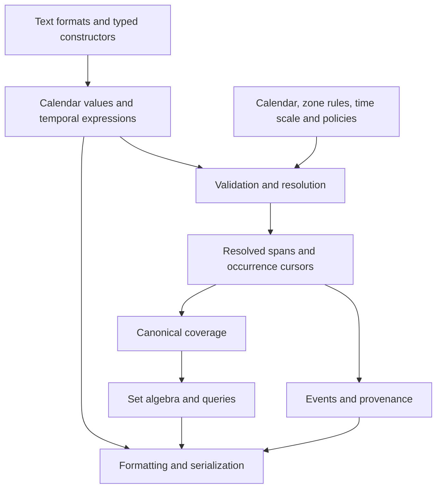
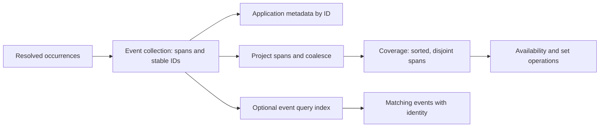
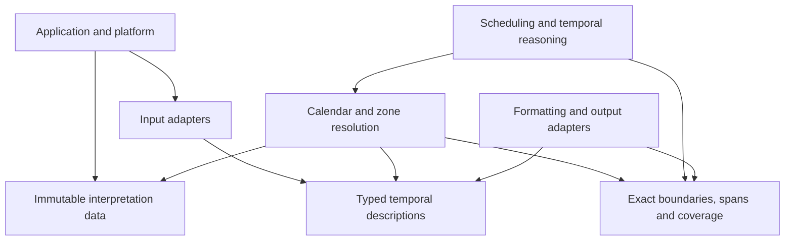

# roc-time design

`roc-time` models human time as calendar meaning and computable spans. It takes [Kip Cole's Tempo](https://github.com/elixir-tempo/tempo) as its starting point and expresses its interval-oriented ideas through small, explicit Roc types and a compact, pure computational core.

This document describes the intended architecture, not the current implementation. It governs semantic boundaries, dependencies, and performance expectations. Change it only when requirements change or evidence invalidates an architectural assumption. Implementation progress, API inventories, verification results and development history do not belong here.

Contributor methodology belongs in [AGENTS.md](AGENTS.md). Proposed API examples below specify intended usage and observable behavior; they do not claim that the package already implements the proposed modules.

## Principles

1. **Preserve meaning until interpretation is explicit.** A calendar day, a recurring appointment, and an uncertain historical date contain information that endpoints alone cannot preserve.
2. **Compute on exact, canonical values.** Resolve calendar and zone interpretation before repeated interval operations. Support microseconds without floating-point loss of equality or ordering.
3. **Make distinctions visible in types.** Calendar arithmetic, elapsed arithmetic, coverage, event identity, uncertainty, and unresolved interpretation have different contracts.
4. **Keep the core pure and portable.** Clocks, files, network access, locale data, and zone-data loading belong to the application or its platform. Given the same values and interpretation context, library operations produce the same results.
5. **Pay for expressiveness where it is needed.** A comparison of two resolved spans must not traverse syntax trees, allocate metadata, or consult a zone database.
6. **Optimize under a stable semantic contract.** Storage choices may evolve. Correctness, exactness, and documented behavior must survive those changes.

## Architecture at a glance

There are three principal stages: describe time, resolve its meaning, and compute with the result. Formatting can operate on descriptions or on resolved values with an explicit presentation context.



Resolution is an explicit boundary with an explicit result. It can succeed, require more context, encounter ambiguous civil time, or produce no occurrences. A query that finds no matching time is different from a query that cannot be evaluated.

The original description remains useful after resolution. A future meeting may need re-resolution when zone rules change; a resolved historical observation may need its original wording for display. Neither representation is reconstructed by guessing from the other.

## The temporal model

### Observable contracts

An operation's name and result must identify which question it answers. The conceptual names here guide the API; a particular representation must not change their meaning.

| Question | Contract |
|---|---|
| Do two values occupy the same time? | Extent equality after explicit resolution to compatible axes; ignores presentation and event IDs |
| Were they described the same way? | Description equality includes resolution, calendar form, qualifications, and interpretation intent |
| Are these the same event? | Application event identity; equal spans do not imply equal events |
| How many intervals are present? | Coverage member count, after coalescing |
| How many appointments occur? | Occurrence count before projection to coverage |
| How many days or hours are visited? | Explicit calendar/elapsed walk with a stated step; never an implicit meaning of collection count |
| How wide is this coverage? | Sum of coordinate widths on its stated scale, with checked accumulation |

Coordinate width on a POSIX-like axis must not be advertised as physical elapsed SI seconds across leap-second events. An elapsed-time API states which scale and conversion evidence justify that interpretation. Two immutable resolutions made with different zone-data versions can still be compared if their resulting axes are compatible; provider version is provenance and cache identity, not an automatic inequality of extents.

### Calendar values describe spans at a resolution

A resolution-bearing calendar value denotes a civil-domain selection at its stated resolution; its timeline preimage can be empty, contiguous or disconnected.
Boundary labels (`ClockTime`, `LocalDateTime`) and exact resolved positions are
separate types: they do not retain which fields a caller originally supplied.
Description types preserve supplied fields, resolution and qualifiers before
lowering to a boundary, local selection or occurrence. A minute value such as
`12:30` differs from a second value `12:30:00`; fractional values `.12` and `.120`
can share a starting boundary while denoting different widths. Do not add this
metadata to every numerical kernel endpoint.

An interchange timestamp can denote an instant rather than a precision-width
span. Adapters preserve their format's meaning: converting an RFC timestamp to
a span at its textual precision requires an explicit application operation.
A microsecond-resolution *calendar value* denotes one local microsecond, whose
timeline preimage can be empty or have multiple components. This does not
redefine every timestamp as a one-microsecond interval.

A civil day denotes its full local-day selection. Resolution computes its preimage under the supplied rules, which can be empty or disconnected. In the ordinary contiguous case it spans that day's start to the next day's start, with an exclusive upper boundary. There is no “last microsecond of the day” calculation in the model.

Resolution is semantic information, not a storage unit. Microsecond storage does not imply that a year was supplied with microsecond precision. Iteration step is another independent concept: a day can be walked by hours or a larger interval by days.

Calendar descriptions use typed fields and explicit variants for supported forms such as calendar dates, week dates, ordinal dates, and local clock values. Rich selections and qualifications belong in expression types. Ordinary dates should not require a list of dynamically named components.

### Coordinate domains are explicit

Civil days, local clock positions, resolved timeline positions, and monotonic clock readings are different domains. Comparing their underlying numbers is meaningless without a conversion contract.

Nominal types and module boundaries prevent accidental mixing. A zone offset is not a named zone, and a local date-time is not automatically UTC. A clock interval that crosses midnight requires a date anchor or an explicit interpretation on the cyclic clock domain.

Every resolved timeline has a defined epoch, time scale, precision, and supported range. Operations combine only compatible domains. Context shared by an entire coverage value should be checked once at its boundary, rather than carried and checked on every endpoint comparison.

### Spans are half-open and nonempty

A finite span has two boundaries with `start < end` and denotes `[start, end)`. Consequently:

- `[a, b)` and `[b, c)` touch but do not overlap.
- Their coverage union is `[a, c)`.
- Intersection emits a span only when its lower boundary is less than its upper boundary.
- Empty results have an explicit empty representation, usually empty coverage; reversed boundaries are invalid.

A span constructor rejects equal endpoints as `EmptySpan` and reversed endpoints as `ReversedBounds`; set intersection represents no overlap as empty coverage. At a finite representation limit, a calendar value whose exclusive upper boundary cannot be represented returns `OutOfRange`. It is never silently shortened to fit. A point query at the largest supported boundary remains distinct from constructing a one-microsecond span there.

Open-ended descriptions use explicit unbounded variants. Unknown boundaries use different variants: lack of knowledge does not mean infinity. Finite computation accepts open descriptions only after bounding them, or through an operation specifically defined for unbounded values. Finite integer values are never reserved as infinity sentinels.

### Elapsed and calendar quantities are distinct

An elapsed quantity is an exact signed displacement on an appropriate time scale. A calendar quantity describes operations such as advancing a month or a civil day. Its elapsed width depends on its anchor, calendar, and possibly zone rules.

Calendar arithmetic specifies component order and policies for invalid destinations, such as advancing from the last day of a long month into a shorter month. Policies are explicit values; an operation does not silently choose between rejecting, clamping, and carrying. Calendar years must not be reduced to a fixed number of months for calendars where that equivalence does not hold.

Adding a civil day preserves the intended calendar operation across offset transitions. Adding 24 elapsed hours preserves an elapsed displacement. Neither operation is implemented through the other without proving the equivalence for the relevant context.

## Microseconds and physical representation

### Coordinate contract

`PosixBoundary` uses the POSIX epoch 1970-01-01T00:00:00Z with exact signed
I64 microseconds, including both integer endpoints. This numerical profile does
not claim a calendar/provider range. Leap seconds have no distinct representation.
`PosixDelta` is a signed coordinate displacement, not a physical SI elapsed
quantity. `difference(a, b)` computes a minus b with checked subtraction.
`PosixSpan.coordinate_width` returns that same coordinate quantity and may fail
even when a span's two boundaries fit. No time-scale conversion data is used or
implied. Numeric nanosecond and Dec conversion supports `RejectSubmicrosecond`,
`Floor` (toward negative infinity), `Ceiling` (toward positive infinity),
`TowardZero`, and `NearestTiesEven`. Exact input remains the default for
`from_nanoseconds`; its `from_nanoseconds_with_rounding` companion takes an explicit
policy. `from_seconds` requires a policy. Rounding operates on the scaled integer
before narrowing to I64, so overflow is determined by the rounded result.
`PosixSpan.from_seconds` first rejects equal/reversed source endpoints, applies
the same explicit policy to both, and rejects a collapsed result as `EmptySpan`.
These numeric conversions do not imply support for sub-microsecond calendar
resolution.

The public semantic contract requires exact microsecond boundaries and arithmetic throughout the documented range, including negative coordinates. Range limits and overflow are explicit; precision must not degrade for distant dates.

**Resolved boundaries use signed I64 microseconds.** Elapsed quantities also use signed I64 microseconds, with distinct nominal types. A finite span stores two boundaries. Dec seconds remain an exact input/output convenience, not the core storage format.

Assume 64-bit machines as the default deployment target. I64 microseconds provide exact arithmetic over approximately ±292,000 years from the epoch. This is a pragmatic general-purpose time model for scheduling, civil time, and historical applications, rather than a specialized high-resolution timestamp system.

**Nanosecond support was deliberately rejected for the core.** Retaining a broad date range at nanosecond precision would require a larger representation; I64 nanoseconds instead restrict the range to roughly ±292 years. I64 microseconds halve boundary and span payloads compared with Dec or I128, and follow [Tempo's microsecond precision](https://github.com/elixir-tempo/tempo/blob/e8a074ed1efed6a0f78b87d900fc4cb0c4156278/lib/tempo/microsecond.ex) more closely. This aligns the resolution with the reference implementation without copying its storage layout or claiming complete API compatibility.

The tradeoff is explicit: distinct sub-microsecond timestamps cannot always be represented distinctly. Such input is rejected by default; rounding requires an explicit policy. No parallel nanosecond core is planned. A specialized type can be considered later for a demonstrated use case without complicating the common representation now.

| Core payload | Representation | Bytes |
|---|---|---:|
| Resolved boundary | One I64 | 8 |
| Elapsed quantity | One I64 | 8 |
| Finite span | Two I64 boundaries | 16 |
| Coverage elements | Flat list of spans | 16 per capacity slot |

These are numerical payload sizes. Collection headers, allocation overhead, and collection-level context are additional; verify final Roc layouts when implementing the types. Keep axis and interpretation context outside each span payload, enforcing compatibility through nominal types and collection boundaries. A million spans require 16 MB of numeric payload, compared with 32 MB for 128-bit boundaries; this is a storage reduction, not a measured throughput claim.

The representation is private and must satisfy these rules:

- Integer equality and ordering correspond exactly to temporal equality and ordering within one domain.
- Integer microseconds need no precision conversion. Nanosecond input must be divisible by 1,000 or use an explicit rounding policy before a checked conversion to I64.
- Dec seconds are converted through their exact scaled integer: `Dec.to_attos(value)` must be divisible by 1,000,000,000,000 under the reject policy. Divide before the checked I64 conversion; do not first narrow the scaled value or convert through floating point.
- Conversions reject overflow and unsupported precision. Rounding policies specify negative behavior; rounding an interval that collapses or reverses its endpoints must not produce a valid nonempty span.
- Boundary arithmetic, subtraction, and width accumulation use checked I64 operations. A displacement outside the quantity range returns `OutOfRange`, even if both endpoints individually fit. Operations that could create sub-microsecond results require validation or explicit rounding.
- Numeric boundary conversion may accept finer-spelled values that are exactly microsecond-aligned. A calendar value declaring a sub-microsecond span still requires an explicit resolution conversion or returns an unsupported-resolution error.
- Negative calendar decomposition has defined floor-division behavior. Calendar arithmetic does not depend on the endpoint's numeric encoding.

The numerical boundary domain is signed I64 microseconds. Constructible spans also need a representable exclusive end, so the greatest boundary cannot start a one-microsecond span. Calendar and provider operations publish their narrower supported ranges. Numerical capacity alone is not a claim that a calendar or zone provider supports every representable coordinate.

Serialization describes semantic values, units, and interpretation. It does not expose native record layout, compiler tags, or the private endpoint encoding. Changing storage must not reinterpret persisted data.

## Coverage and events

**Coverage answers where time is occupied. Events answer what happened or is planned there.** They share spans but have distinct collection invariants.



Coverage has one canonical form: finite nonempty spans, sorted by start, with overlaps and touching spans merged. Empty coverage is valid. This makes extent equality independent of construction order or original segmentation.

Coverage queries distinguish whole overlapping members from clipped intersections. Complement requires an explicit finite universe. Public construction establishes canonical invariants once; internal operations preserve them. Immutable results may share backing storage, so an extracted list or retained slice need not detach its allocation.

The default storage is a flat Roc `List` of compact span records. Sorted disjoint spans have increasing starts and ends. Binary search can locate the first span whose end exceeds a query's start, followed by a scan until starts reach the query's end. A coverage overlap query therefore does not require an interval tree.

Events can overlap, touch, and have identical extents while remaining distinct. Metadata stays in a separate application-facing layer, referenced by stable IDs where appropriate. Coalescing events into coverage is intentionally lossy and explicit. Event identity cannot be recovered from the coverage result.

An event index is a derived acceleration structure. Choose its representation for its workload; arbitrary overlapping events do not satisfy coverage's binary-search assumptions. Flat indexed nodes or other packed structures are preferred candidates before adopting many individually allocated nodes.

Operations that retain provenance must define how contributors combine and how segments split. Their result size can exceed that of plain coverage. They do not inherit coverage's costs or coalescing rules by assumption.

## Interpretation and dependencies

The calendar layer converts between validated civil fields and a shared civil-day axis within its supported range. Gregorian conversion is the initial foundation; additional calendars implement the same conceptual contract without imposing their complexity on span algebra.

### Calendar and local coordinates

Calendar providers publish their supported ranges, numbering conventions and day boundaries. Gregorian and Julian profiles use proleptic rules and astronomical years, including year zero as 1 BCE; neither infers regional historical reforms. A shared civil-day axis uses Gregorian 1970-01-01 as day zero, also Julian 1969-12-19. It labels civil days, not UTC midnights, elapsed durations or astronomical noon-based Julian Days. Conversion checks the destination provider's range. Equal-day descriptions in different calendars have equal extents but distinct description identity.

A local clock label is distinct from both elapsed time and a resolved boundary. Attaching a date does not select a zone or occurrence, nor prematurely restrict the description to the finite timeline range. Local-position comparison uses civil day and clock position; description equality additionally preserves calendar identity. Calendar conversion preserves the clock label. Unsupported leap-second or end-of-day notation requires an explicit adapter contract, never silent normalization.

Calendar arithmetic declares its calendar, component order and destination policy. Ordered years, months and days are not interchangeable with a combined month count: clamping 2020-02-29 by one year, one month and one day gives 2021-03-29, whereas combining the first two components into thirteen months retains day 29. Each component must remain within the provider range, even if later components would cancel an overflow. A multi-month step chooses its destination once rather than repeatedly repairing intervening months. Reject, clamp and carry are distinct policies; carrying January 31 into February counts from February's first day and can reach March 3.

Fixed offsets state a local-minus-timeline sign convention and whole-second units. Resolving subtracts the offset; projecting adds it and requires a destination calendar. Conversion checks the final coordinate range without premature narrowing, and negative calendar decomposition uses floor division. A mathematical offset domain is not a claim that every value is a real-world zone offset or valid format token. Unknown-offset assertions require a separate representation. [RFC 3339 section 4.2](https://www.rfc-editor.org/rfc/rfc3339#section-4.2).

### Finite zone interpretation

Zone rules are immutable data with source identity, version, finite validity, initial offset and ordered transitions. The initial offset applies at the lower bound; a transition's new offset applies at its exact boundary; the upper validity bound is excluded. Invalid ordering, malformed metadata and out-of-validity lookup produce structured errors. Names and versions label data; they neither trigger a registry lookup nor certify content identity.

Local boundary classification must prove completeness before returning unique, gap or fold. For a local label L and authoritative offset bounds [minimum, maximum], every possible inverse candidate lies in [L - maximum, L - minimum]. If that range exceeds the finite axis or available rules, interpretation fails even when one visible occurrence exists. Bounds must cover possible offsets outside the loaded window, not merely observed table entries. Without a narrower provider guarantee, use the full declared offset domain.

Each constant-offset timeline segment contributes at most one inverse occurrence. Preserve all distinct occurrences in chronological order; a fold need not contain only two. Occurrence choice is explicit: require uniqueness, choose first or last, or require a matching asserted offset. An offset conflict does not fall back to another occurrence. A fold policy does not imply a gap-shifting policy.

An appointment resolves its two boundaries under independently supplied policies and validates their timeline order. Local field order need not match that order across a fold. A local selection instead translates and clips its half-open range against every constant-offset segment, retaining disconnected coverage. It must not take the hull of chosen endpoint occurrences. Completeness includes the earliest possible start and latest possible exclusive end; that end may equal the upper validity boundary. Missing data is never silently clipped into a complete answer. A proven skipped day is empty coverage, not an interpretation failure.

### Zone database distribution

Ship the interval/calendar core without a transitive zone-database dependency.
The intended first-party companion package is the recommended default data
source for named-zone applications; users explicitly pin it alongside roc-time.
"Default" here means the documented, supported choice, not an ambient database
or an implicit download at runtime. Fixed-offset and interval-only applications
need no companion. Application/platform providers and deliberately selected-zone
bundles remain supported through the same interpretation boundary.

The companion supplies versioned data, not a second temporal engine. Prefer a
versioned structural interchange boundary adapted once by roc-time into validated
`ZoneRules`; do not require the data package to return nominal core types from
its own pinned roc-time version. Roc's content-based nominal identity makes that
coupling sensitive to core module changes. The data contract must state schema
version, POSIX epoch/second units, source release and profile, canonical and
requested zone identifiers, finite validity, transitions, offset bounds and
future-rule semantics. Unknown schema or malformed data fails during adaptation.
The concrete payload representation remains an implementation decision requiring
size/compiler measurements; generated Roc tables and compact TZif are candidates.

The ordinary caller path should be: select a named zone and finite query window
from the recommended data package, adapt through a small public operation, then
pass the resulting rules/context to resolution. Lookup need not imply effects:
a compiled provider is pure; a platform provider loads data before that same
boundary. Do not require routine callers to hand-build transitions, calculate
global offset bounds, parse TZif, or implement a registry. Custom providers use
the same adapter and validation. Preserve the requested alias alongside the
canonical data identity. Distinguish an unknown identifier, a zone omitted by an
explicit subset profile, unavailable time range and invalid/unsupported data.

Pin data releases independently from core releases. Updating a dependency is an
explicit application decision; prior snapshots remain unchanged. A bounded pack
must advertise its horizon and reject queries beyond it, including ranges needed
for candidate-completeness proof. Future POSIX footer rules must be expanded under
finite work/range limits or explicitly remain unsupported; never extrapolate a
final offset or silently truncate history. Historical coverage is the selected
IANA profile's evidence, not a claim of complete historical truth.

A documented global-data default includes compatibility aliases. Optional subset packs state their omissions and horizon explicitly. Choose payload encoding from measured acquisition, compiler and runtime costs for core-only, one-zone and dynamic-name applications; unused-data elimination must not be assumed to remove download or compilation costs. Representation is an implementation choice, not a reason to couple every core user to a database.

Source digests are provenance, not authentication of arbitrary supplied records or substitutes for content identity. Acquisition verifies source bytes; adaptation validates semantic data. Preserve requested aliases separately from canonical identity.

[IANA's theory](https://data.iana.org/time-zones/tzdb/theory.html) qualifies
historical coverage, including pre-1970 and `backzone` data. Pin the source/build
profile and applicable notices, as described by
[IANA's database links](https://data.iana.org/time-zones/data/tz-link.html).
Any production TZif adapter must declare and test the
[RFC 9636](https://www.rfc-editor.org/rfc/rfc9636.html) footer and truncation
semantics it supports. Reading explicit transitions alone is not full support.


Zone resolution maps local values using a supplied ruleset. A local boundary may have one matching position, be ambiguous, or lie in a gap. Policies and structured outcomes expose those cases. Resolving both boundaries of a calendar span must also validate the resulting span: exceptional civil dates can be skipped or altered by zone transitions.

Distinguish **an appointment between chosen boundary occurrences** from **all positions whose local labels fall in a selection**. The former resolves each endpoint under explicit gap/fold policies and validates their order. The latter computes the preimage of the civil selection under zone rules and may yield empty or disconnected coverage. Taking the earliest start and latest end would incorrectly fill gaps between repeated local-time ranges. Calendar-day selection uses this set interpretation; a skipped civil day yields empty coverage. Fixed-offset conversion is the simple special case.

Boundary resolution reports `Unique`, `Gap`, or `Fold` inside a successful interpretation result; unknown zones, missing rules, out-of-range data, and inconsistent supplied offsets are errors. A strict resolver may turn a gap/fold into a policy error, but never silently chooses an occurrence. An explicit numeric offset supplied with a named zone must be checked against the selected occurrence.

Time-scale conversion is separate from zone conversion. A POSIX-like scale cannot uniquely represent leap seconds. Unsupported leap-second input must remain explicit or return an error; it must not be normalized into a different second. A leap-aware interpretation requires a defined scale and conversion data with a documented validity range.



Arrows here point from a consumer to its dependency. The application acquires clock readings and interpretation data and supplies them to the library. The core has no dependency on the application, adapters, or interpretation providers. Providers are explicit data and operations, not a global registry. Their exact Roc signatures should allow specialization and avoid repeated dynamic dispatch in inner loops.

A resolved snapshot binds its result to its original description, explicit policies and exact immutable interpretation data. Construction prevents pairing arbitrary results with unrelated evidence. Accessors read stored results without resolving again. Re-resolution applies new data explicitly, preserving the original source and policies and returning a new snapshot or structured error. A newly conflicting offset assertion remains a conflict.

Compatible-axis position and extent comparison ignore provenance differences. Snapshots retain actual interpretation data even when names and versions are reused; labels alone are insufficient cache keys. Sharing can retain a whole rule table, so snapshot memory costs include retained source data.

Resolved values are snapshots of a particular interpretation. Updating zone or calendar data does not mutate their meaning. Re-resolving an expression is a distinct operation. Caches must be tied to the source description, relevant policies, and provider identity/version. No unbounded global cache is required by the library.

## Expressions, recurrence, and uncertainty

Typed constructors and text parsers converge on the same validated semantic forms. Syntax-specific concerns such as source spelling and error locations may be preserved alongside those forms, without entering the numerical kernel. ISO, EDTF, and scheduling adapters should share interpretation machinery rather than each implementing another calendar engine.

A recurrence is a rule and an anchor, not an eagerly allocated list. Its execution uses explicit cursor state and a next/fold interface. Calendar periods generate candidates, selectors filter them, and zone interpretation resolves the resulting occurrences. A monthly rule advances by calendar periods rather than scanning microseconds.

Finite materialization requires a bound or a finite rule. Callers can stop iteration early. Rules that may examine many candidates support work limits and report incomplete evaluation explicitly; a time horizon alone does not guarantee cheap evaluation. Per-period buffering, such as selecting positions within a month's candidates, is permitted and accounted for.

A materialization outcome is either `Complete` or `Limited`, with partial output and resumable cursor state in the latter case. Partial output is never returned as an ordinary complete coverage result. Resume preserves count, exclusion, deduplication, and selection state and is bound to the same rule and interpretation context. Concatenated resumed batches must match uninterrupted execution. Limits apply to candidate work and output, not merely to successful matches.

Adapters declare their recurrence semantics. In particular, RFC 5545 invalid generated dates are skipped and do not consume COUNT; COUNT belongs to the series rather than restarting at a query window, and exclusions do not replenish it. This is different from repeatedly adding a month with a clamping policy. DTSTART, UNTIL inclusivity/type, BY-rule ordering, and exclusions are conformance requirements of the adapter. [RFC 5545 recurrence rules](https://www.rfc-editor.org/rfc/rfc5545.html#section-3.3.10), [recurrence-set construction](https://www.rfc-editor.org/rfc/rfc5545.html#section-3.8.5.1).

Source occurrence identity survives until a caller requests coverage. Enumeration contracts state ordering and duplicate behavior, especially when zone transitions map local candidates unexpectedly. Coverage construction performs any required sorting and coalescing; it never trusts recurrence order without a guarantee.

Uncertain expressions remain uncertain. “One of these days” is different from “all of these days,” and an approximate date is not automatically a wider certain interval. A query distinguishes definite, possible, and impossible relationships where its model supports them. An unsupported reasoning problem is an explicit outcome, not a fabricated certainty.

For a supported evidence model, “definite” means true for every admissible interpretation; “possible” means true for at least one but not all; “impossible” means true for none. Inconsistent evidence is an error, not vacuous certainty. Merely parsing an approximate qualifier does not supply a numerical tolerance or a probability model.

## Standards adapters and semantic preservation

Broad standards coverage is an intended capability, not a current conformance
claim. Each adapter declares its edition and supported profile; syntax acceptance,
semantic preservation, interpretation, formatting and persistence need separate
evidence. Native lossless persistence is distinct from standards interchange.

| Target | Required scope distinction |
|---|---|
| ISO 8601-1:2019 | Name adopted amendments and exact supported date/time forms |
| ISO 8601-2:2019 and Amendment 1:2025 | Part 2 exceeds EDTF; canonical expressions and arithmetic require edition-specific contracts |
| EDTF, Library of Congress published specification, Levels 0–2 | Preserve independent endpoint resolution, component qualifications, masks, sets, seasons and significant digits |
| IXDTF, RFC 9557 (2024) with RFC 3339 base semantics | Preserve offset assertions and annotation interpretation independently of syntax |
| RFC 5545 (2009) recurrence profile | Standard series rules distinct from native recurrence extensions |

[ISO's Part 2 catalogue](https://www.iso.org/standard/70908.html) identifies
Amendment 1:2025. Public abstracts do not prove clause-level conformance. Obtain
normative requirements before declaring that scope complete; lack of those
clauses does not prevent implementing the independently specified foundations.

Recognition, symbolic validation, calendar conversion and finite-axis
materialization are separate stages. Descriptions can outlive the numerical
range of the current providers. Long years, exponents, finer fractions and
unresolved leap-second notation must not be silently forced into `GregorianDate`
or `ClockTime`. Each adapter declares bounded input/work limits and symbolic
range, returning structured unsupported/range errors beyond them. Numerical
precision reduction still requires explicit policy. Recognition alone does not
establish interpretation or computational support.

### Interval and qualification meaning

An interval description preserves each endpoint's knowledge, supplied resolution
and qualifiers. Exact boundary appointments, uncertain-endpoint intervals and
inclusive all-of ranges have distinct lowering contracts. In particular, EDTF
`1964/2008` begins sometime in 1964 and ends sometime in 2008; replacing it with
an exact interval between year starts invents knowledge. Mixed endpoint
precision such as `2004-02-01/2005-02` remains meaningful. Component qualification
in `2004-06~-11` is not whole-value approximation; `1984-1X` describes alternatives,
not certain coverage. Seasons may require location/context; significant-digit
expressions preserve an estimate as well as admissible interpretations. These
forms converge on shared semantic descriptions, not separate parser-specific
interpretation engines. [Library of Congress EDTF specification](https://www.loc.gov/standards/datetime/edtf.html).

### IXDTF assertions and annotations

The adapter preserves whether an offset asserts the local relationship.
`Z` and `-00:00` differ from an asserted numeric `+00:00` under RFC 9557's
semantics; they must not all become the same `FixedOffset` assertion.
`2022-07-08T00:14:07Z[Europe/Paris]` can identify the UTC instant presented as
02:14:07 locally without an offset conflict. In contrast, a numeric asserted
offset is checked against the named rules when interpretation requires it.
The `u-ca` annotation selects preferred calendar presentation; it does not
reinterpret the timestamp's Gregorian fields as Hebrew or another calendar.

Parse annotations without fetching zone rules. Preserve criticality and the
information needed for the standard's ordering, duplicate and conflict rules;
unknown critical annotations fail. Interpretation requiring unavailable rules
returns a missing-context error. Any supported policy for elective conflicts is
explicit. Preserve the semantic distinction in formatting and persistence.
[RFC 9557 sections 2–5](https://www.rfc-editor.org/rfc/rfc9557.html).

### Calendar capabilities and cross-zone algebra

The Gregorian/Julian `{year, month, day}` shape is not a universal
calendar-provider interface. Providers separately declare conversion, year/month
advancement, stable month identity, era conventions and day-boundary context.
A leap-month calendar's ordinal month can differ from its stable month identity;
recurrence and anniversaries cannot silently substitute one for the other.
Gregorian arithmetic does not imply arithmetic support for every calendar.
[Temporal's calendar guidance](https://tc39.es/proposal-temporal/docs/calendars.html)
provides comparative cases; each adopted calendar still needs its own sources.

Resolve each cross-zone operand with its own explicit interpretation context and
finite rule validity before combining compatible-axis coverage. Missing rules
for any requested part must produce an error or explicit incomplete outcome,
never a clipped complete result. Presentation of a result uses a separately
chosen context; inheriting the first operand's zone is an explicit display
policy, not part of set equality. Swapping union/intersection operands preserves
coverage even if independently chosen presentation differs. Disconnected repeated selections retain every component without filling
intervening gaps; skipped dates can produce empty complete coverage only
when rules establish that result.

Conformance follows the adopted standards and semantic contracts, not agreement with another library's support claim. Precision distinctions, uncertain endpoints, scoped qualifications, annotation assertions and cross-zone context are independent obligations.

## Motivating Roc usage

These are **proposed API sketches**, using Roc records, tag unions, pure functions, and `?` to propagate `Try` errors. The module names are a design vocabulary, not imports available today. Surrounding package/import declarations are omitted. Acceptance outcomes are requirements; formatter acceptance alone is not typechecking or execution evidence. Promote each sketch to an executable example against the real package as its underlying implementation lands.

### Find availability across offsets

Two appointments specified in different offsets must subtract correctly from a UTC work window. Formatting does not participate in the subtraction.


```roc
booking_availability = |_| {
    work = Iso8601.posix_span("2026-06-15T09:00:00Z/2026-06-15T17:00:00Z")?
    paris = Iso8601.posix_span("2026-06-15T12:00:00+02:00/2026-06-15T13:00:00+02:00")?
    utc = Iso8601.posix_span("2026-06-15T10:30:00Z/2026-06-15T12:00:00Z")?
    busy = Coverage.from_spans([paris, utc])?
    available = Coverage.difference(Coverage.from_spans([work])?, busy)?
    Ok(available)
}
```

Expected coverage is `[09:00, 10:00)` and `[12:00, 17:00)` UTC on that day: two windows, six hours of coordinate width. The appointments remain two events even though their busy coverage becomes one span. Replacing the explicit offset with `Europe/Paris` requires supplied zone rules; an offset literal alone makes no promise about future dates in that city.

### Preserve one-microsecond boundaries


```roc
adjacent_samples = |_| {
    a = PosixBoundary.from_seconds(0.000001.Dec, RejectSubmicrosecond)?
    b = PosixBoundary.from_seconds(0.000002.Dec, RejectSubmicrosecond)?
    c = PosixBoundary.from_seconds(0.000003.Dec, RejectSubmicrosecond)?
    first = PosixSpan.new(a, b)?
    second = PosixSpan.new(b, c)?
    Ok({
        relation: PosixSpan.relation(first, second),
        overlaps: PosixSpan.overlaps(first, second),
    })
}
```

Expected result: `Meets` and `Bool.False`. `from_seconds` uses the explicit POSIX epoch convention, independent of private storage. Supplying `0.0000001.Dec` under `RejectSubmicrosecond` must fail. Dec is a convenient exact input format here; validated values are stored as I64 microseconds.

### Resolve a local day across a clock change

```roc
day_width = |context| {
    day = Civil.day({ year: 2026, month: 10, day: 4 })?
    zone = Zone.named("Australia/Melbourne")?
    occupied = Resolve.day(context, zone, day)?
    Coverage.width(occupied)
}
```

With a rules fixture containing Melbourne's transition from UTC+10 to UTC+11 on that date and a POSIX output axis, the expected width is 23 hours. This is the whole civil day, not an instruction to add 24 hours. The test must supply versioned rules rather than depend on the machine's current database. Separately test a skipped date and a repeated clock range that yields two disjoint spans. A syntactically valid zone name is not proof that the context has its rules.

### Make month-end policy visible


```roc
next_invoice_date = |_| {
    issued = Civil.day({ year: 2025, month: 1, day: 31 })?
    one_month = CalendarDelta.months(1)
    CalendarArithmetic.shift_day(issued, one_month, Clamp)
}
```

Expected result: 2025-02-28. `Reject` produces an invalid-destination error. Clamped addition is not generally invertible: subtracting a month from February 28 gives January 28. A schedule anchored to the 31st must retain its original rule rather than use this clamped date as the next anchor.

### Expand a bounded series without concealing a work limit

```roc
month_end_visits = |context| {
    start = Civil.day({ year: 2025, month: 1, day: 31 })?
    rule = Recurrence.from_rrule(start, "FREQ=MONTHLY;COUNT=3", CalendarDelta.days(1))?
    window = Iso8601.posix_span("2025-01-01T00:00:00Z/2025-06-01T00:00:00Z")?
    batch = Recurrence.collect(context, rule, {
        zone: Zone.utc,
        window,
        max_candidates: 1000,
        max_occurrences: 10,
    })?
    match batch {
        Complete(occurrences) => Ok(occurrences)
        Limited(progress) => Err(NeedMoreWork(progress))
    }
}
```

Expected occurrence starts are January 31, March 31, and May 31, with one civil-day span each. February and April do not supply a 31st. A narrower query starting in March must not restart COUNT. Reducing the work limit may yield `Limited`, never an apparently complete list of fewer appointments. Excluding March 31 leaves two occurrences; it does not add July 31 as a replacement.

### Keep alternatives distinct from coverage

```roc
possible_visit = |_| {
    first = Civil.day({ year: 2026, month: 6, day: 15 })?
    second = Civil.day({ year: 2026, month: 6, day: 16 })?
    evidence = Evidence.one_of_days([first, second])?
    Evidence.overlap_day(evidence, first)
}
```

Expected result: `Ok(Possible)`, because the visit could be on either day. Converting both alternatives to ordinary coverage and asserting that the visit definitely occurred on June 15 would be wrong. No timezone is needed for this query because all values are in the same civil-day domain.

These use cases adapt Tempo's motivating [availability](https://github.com/elixir-tempo/tempo/blob/main/guides/tutorial-booking-availability.md), [enumeration](https://github.com/elixir-tempo/tempo/blob/main/guides/enumeration-semantics.md), and [uncertainty](https://github.com/elixir-tempo/tempo/blob/main/guides/uncertain-dates.md) ideas. Their Roc API shapes and explicit error boundaries are this project's proposals.

Temporal reasoning builds on the exact core. Concrete Allen relations classify nonempty spans. Sets of possible relations can use compact masks and composition tables. Quantitative difference constraints form a separate solver layer; consistency of a general disjunctive relation network must not be claimed from a solver for a narrower problem.

## Idiomatic Roc implementation

Use nominal types for semantic distinctions, records for fixed data, and tag unions for alternatives and structured errors. Hide representation through module interfaces. Public construction validates invariants; internal operations consume established invariants rather than rediscovering them repeatedly.

Keep common operations specialized over compact numeric values. Avoid a universal record containing optional parser fields, recurrence rules, zone strings, metadata, and cached endpoints. Rich types are appropriate at the expression boundary; small types are appropriate in the kernel.

Ordered scalar domains support Roc comparison operators within the same nominal type when that order has temporal meaning. Spans and coverage deliberately have no arbitrary total-order
operator: use their temporal relations or set operations. Scalars, spans and
canonical coverage expose hashing consistent with equality for dictionary/set
keys; hash values are not a persistence format. Coverage iteration visits whole
canonical spans in order, not microseconds. Domain-labelled inspection is for
diagnostics, not a stable serialization contract. Numeric construction keeps
named units, and arithmetic remains checked rather than hiding errors behind
ordinary numeric operators.

Immutable APIs should permit Roc's allocation reuse. Build results with capacity-aware accumulators and forward scans. Do not translate Elixir linked-list construction patterns mechanically. Sharing old lists can require copying, and a small slice can retain a large backing allocation; both behaviors belong in memory measurements.

Batch construction and edits are the normal path for flat coverage. An isolated insertion may be linear. If a workload needs frequent persistent updates, add an appropriate collection or index without changing the meaning of coverage.

Effects remain at application boundaries. Reading the current time or loading zone data produces inputs for pure functions. Tests can supply those inputs directly, and the same core can serve native programs and Wasm applications.

### Inspection, explanation and presentation

Make temporal values understandable in a debugger through Roc's
`to_inspect : T -> Str` hook. Inspection is a concise semantic diagnostic:
identify the nominal domain, meaningful fields or expression kind, and relevant
unresolved state. It must not expose only an opaque backing number or imply that
a local label is already a timeline instant. Preserve exact seconds and
microseconds in displayed scalar fields. The hook serves `Str.inspect` and
debugging.
Inspection text is neither a stable interchange format nor necessarily a
parseable literal.

Provide a separate explicit explanation facility for callers asking what a
description means and what further interpretation it needs. This is semantic
help suitable for an interactive tool or application, distinct from localized
date/time formatting and versioned serialization. Explanation and inspection share semantic facts but have distinct cost and output contracts.

Use one source of typed semantic facts for concise inspection and detailed
explanation. Facts distinguish the original description and resolution,
calendar/axis, qualifiers and their scope, endpoint knowledge, interpretation
requirements, and any explicitly supplied resolution result and provenance.
Renderers consume those facts rather than parse diagnostic prose or implement
a second resolver. A shared fact visitor can emit only the requested summary;
ordinary scalar inspection must not build a detailed explanation tree first.
Keep this machinery outside compact endpoint storage and coverage inner loops.

Context-free explanation describes the value as supplied. It may report
intrinsic symbolic constraints, but must not materialize selections, enumerate
recurrences, choose an occurrence, infer a timezone, or consult provider data.
To explain an interpretation, accept a result bound to its original description
and explicit immutable context, or use a separately named bounded analysis
operation which invokes the normal resolver. Reject mismatched supplied evidence.
Report missing context, unsupported interpretation, out-of-range results,
inconsistent evidence and limited evaluation explicitly; none may disappear as
an omitted span or be described as empty coverage. A complete empty preimage
remains a successful, explainable result. Formatting a supplied result does not
re-resolve it.

Inspection uses documented fixed preview limits for collection members, nested
expressions and embedded text, with visible truncation. It must not walk an
entire collection merely to format a prefix. Detailed explanation accepts finite
work/output limits; report truncation separately from semantic evaluation
completeness. Cost is bounded by visited description/result nodes and rendered
text, not the number of instants or potential occurrences denoted. Exact totals
may be shown when already available; otherwise say they were not computed.
Locale and terminal/HTML styling are explicit rendering choices; the default diagnostic needs neither ambient locale nor terminal capability.

Tempo provides useful precedent: its separate
[explanation structure and renderers](https://github.com/elixir-tempo/tempo/blob/e8a074ed1efed6a0f78b87d900fc4cb0c4156278/lib/explain.ex)
and [inspection implementation](https://github.com/elixir-tempo/tempo/blob/e8a074ed1efed6a0f78b87d900fc4cb0c4156278/lib/inspect.ex)
serve different uses. We retain that separation while requiring explicit
interpretation and bounded work. Explanation must not introduce Tempo's implicit
iteration granularity into roc-time's explicit walk contract.

Semantic examples (R01–R02, R07–R09, R12–R16):

- A Gregorian masked year `156X` reports the years 1560–1569 as admissible
  values, retaining its unknown digit. Any `[1560-01-01, 1570-01-01)` summary
  is labelled a civil-domain envelope of possibilities, not proof that every
  year occurred or resolved timeline coverage. It claims no monthly iteration
  unless a walk with that step was explicitly supplied. A noncontiguous mask
  cannot be explained as its filled envelope.
- Minute and second descriptions with the same start remain distinguishable;
  fractional resolutions `.12` and `.120` remain distinguishable. Inspecting
  `LocalDateTime` does not invent source resolution discarded by that type.
- A local selection in a fold explains all supplied coverage components; a
  boundary appointment retains its unresolved occurrence choice. A proven
  skipped date, missing rules and a limited evaluation produce different text
  and typed explanation states.
- An approximate qualifier invents no tolerance. Unknown endpoints differ
  from unbounded endpoints; alternatives differ from all-of coverage. An
  unbounded recurrence can be inspected and explained without expansion.
- A large coverage value and a deeply nested expression produce bounded,
  visibly abbreviated diagnostics through direct inspection and actual `dbg`.
  Rendering existing snapshots performs no provider lookup; plain and styled
  renderers agree on the underlying facts. Tests assert these semantic facts
  separately from optional prose snapshots.

## Performance objectives

These are engineering targets and review criteria, not measured implementation claims. Let `n` and `m` be input span counts and `k` the number of output spans or matches. Complexity assumes compatible resolved domains and constant-cost endpoint comparison.

| Operation | Target |
|---|---|
| Compare boundaries or classify two spans | O(1), no heap allocation |
| Construct coverage from arbitrary spans | O(n log n) sort and O(n) coalescing |
| Validate and coalesce already sorted spans | O(n) |
| Coverage union, intersection, difference | O(n + m + k), sequential passes |
| Point containment | O(log n), no result allocation |
| Overlap query | O(log n + k), with a fold option to avoid a result list |
| Coverage complement within a finite window | Seek and emit relevant gaps; no time-unit enumeration |
| Storage for finite coverage | O(n) compact payload, no allocation per endpoint |
| Recurrence evaluation | Work follows candidate periods and selectors, with explicit buffering and work bounds |

Set operations never enumerate the microseconds inside a span. Converting to a comparable axis occurs before repeated sweeps and searches. Parsing, formatting, calendar conversion, metadata resolution, and provider lookup are absent from the coverage inner loop.

Measure latency, throughput, allocation count, allocated bytes, and retained memory separately. Benchmark input construction, interpretation, and core operations separately as well as end to end. Include small inputs, dense and sparse sets, empty results, owned and shared collections, and native and Wasm targets. Accept additional structures or caching only when a representative workload benefits without weakening semantics.

## Acceptance requirements

These stable identifiers define observable acceptance contracts. Semantic claims require independently justified expectations appropriate to their domain; self-consistent round trips alone cannot establish the intended meaning. Contributor verification procedures belong in [AGENTS.md](AGENTS.md), not this architecture.

| ID | Required observable behavior |
|---|---|
| R01 — precision and range | Preserve microsecond distinctions at zero, negative coordinates, and supported extremes. Reject sub-microsecond input by default. Reject overflow in conversion, exclusive-upper-bound construction, subtraction, and total-width accumulation; never wrap or saturate silently. |
| R02 — domain separation | Civil, POSIX, leap-aware, and monotonic values cannot mix through raw numerical equality. Invalid static combinations fail typechecking; dynamic incompatible-axis combinations return structured errors. Neither event identity nor provider version substitutes for extent equality. |
| R03 — span boundaries | Constructors reject empty/reversed spans. Touching spans meet without overlap. All 13 concrete Allen relations and their inverses agree with direct endpoint order, including one-microsecond spans. |
| R04 — coverage algebra | Construction is order-independent and idempotent, merging overlap and touch. Union/intersection are commutative and idempotent. Difference is disjoint from its subtrahend. Complement is relative to an explicit finite universe; its union with clipped input equals that universe. Membership agrees with an independent small discrete-domain oracle. |
| R05 — civil arithmetic | Proleptic Gregorian conversion round-trips negative years, year zero, leap days, and century boundaries within a published range. Year zero means 1 BCE. Clamping/rejection and component order are specified; tests must not assume clamped arithmetic is invertible. |
| R06 — calendar interoperability | Supported calendars convert through a stated common civil-day convention. Independently sourced equal-day fixtures have equal extents. Unsupported calendars/ranges fail explicitly; no silent Gregorian substitution. Calendars whose day-boundary convention needs extra context must declare it. |
| R07 — zone interpretation | Test unique boundaries, gaps, folds, non-hour transitions, skipped dates, disjoint local selections, and offset/name conflicts using fixed rule fixtures. Boundary-appointment and local-selection semantics remain distinct. No dependency on host zone configuration. |
| R08 — scales and elapsed time | Publish epoch, scale, leap handling, and conversion-data validity for each supported axis. Unsupported leap seconds error or remain unresolved. POSIX coordinate width is not labeled physical elapsed duration without the necessary conversion contract. |
| R09 — interpretation snapshots | Reusing a resolved value performs no zone lookup. Re-resolution is explicit; changing provider data invalidates dependent caches. Same-axis snapshots remain comparable even when provenance differs. |
| R10 — events and counts | Two equal-span events retain distinct IDs. Coverage projection is explicit and lossy. Member count, occurrence count, walk count, and width have different named APIs. Provenance-aware splitting specifies contributor combination and preserves surviving identities. |
| R11 — recurrence semantics | Calendar stepping does not drift through elapsed arithmetic. RFC adapters test DTSTART, COUNT, UNTIL, invalid dates, BYSETPOS, duplicate/exclusion ordering, and overlapping-window queries. Query restriction does not reset series state. |
| R12 — bounded evaluation | Limits account for candidates, buffered work, and output. `Limited` cannot masquerade as `Complete`; resumption equals uninterrupted output without skipped or duplicated occurrences. Invalid/stale cursor contexts fail explicitly. |
| R13 — uncertainty and reasoning | Alternatives differ from all-of coverage. Definite/possible/impossible results agree with enumeration of small admissible models. Inconsistent evidence and unsupported reasoning error. No inferred tolerance for approximate qualifiers. |
| R14 — parsing and persistence | Distinguish malformed, unsupported, incomplete, and out-of-range input. Preserve resolution and meaningful qualifiers in semantic round trips. Unknown critical extensions fail. Source-text fidelity is separately advertised. Persistence records axis/units/version and does not depend on native layout. |
| R15 — resource behavior | Verify core operations against the stated complexity/allocation targets using varying sizes and ownership patterns. Measure retained slices, not just allocation throughput. No per-microsecond loops, repeated parsing, or hidden provider lookups in set operations. |
| R16 — API evidence | Each advertised usage compiles and runs against the real package on the pinned compiler. Wrong-domain examples fail for the intended reason. Native and supported Wasm paths agree on semantic fixtures. Proposed sketches remain labeled until this evidence exists. |

Cross-cutting failure behavior: public data errors are returned through `Try` with actionable structured information. A result that requires more interpretation, unsupported functionality, exhausted work, and an empty answer remain distinguishable. Private invariant violations may be programmer errors; malformed user input must not reach them.

Before a public temporal API is released, the coordinate profile, supported calendar range, gap/fold policies, recurrence profile, and persistence contract must be settled and documented. Semantic choices must be explicit rather than introduced as undocumented defaults. Scope can be delivered incrementally without describing an unimplemented capability as supported.

Build outward from the exact span and coverage kernel, then calendar interpretation and arithmetic, recurrence, adapters, and reasoning. No advanced feature should require making basic interval operations depend on its machinery. Contributor review and validation procedures live in [AGENTS.md](AGENTS.md); changes to interpretation, precision, range, or persistence remain changes to this design's semantic contract.

## Acknowledgements and background

This design owes its central direction to **Kip Cole's work on [Tempo](https://github.com/elixir-tempo/tempo)**. In particular, Tempo's treatment of calendar values as intervals at meaningful resolutions, calendar-relative durations, shared interpretation of temporal expressions, and temporal set algebra underpin this architecture. Credit for that foundation belongs to Kip and Tempo's contributors.

Tempo's [documentation](https://hexdocs.pm/ex_tempo/) explains the model and its broader capabilities. Its [interval implementation](https://github.com/elixir-tempo/tempo/blob/main/lib/tempo/interval.ex), [set operations](https://github.com/elixir-tempo/tempo/blob/main/lib/operations.ex), and [recurrence adapter](https://github.com/elixir-tempo/tempo/blob/main/lib/tempo/rrule/expander.ex) are useful references for the ideas discussed here.

`roc-time` adapts that foundation to Roc through explicit computational domains, compact numerical storage, and separate coverage and event collections. It is an independent project, not a claim of API compatibility or endorsement by Tempo's authors. Tempo is published under the [Apache License 2.0](https://github.com/elixir-tempo/tempo/blob/main/LICENSE.md); any implementation code adapted from it must retain the applicable upstream attribution and license notices.
